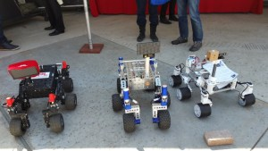

Currently using the following URL, until we figure out a domain name.  [http://bit.ly/sgvhak_rover](http://bit.ly/sgvhak_rover)

# About 
[SGVHAK](http://www.sgvhak.org/) is a maker group based in the San Gabriel Valley.

The [JPL Open Source Rover](https://opensourcerover.jpl.nasa.gov/) is a relatively inexpensive and accessible project for high school and college classes to exercise mechanical and electronics and software engineering using parts that could be easily sourced from hobbyist stores. 

JPL beta-tested their build instructions at a few schools and with the SGVHAK maker group. The ultimate goal was to refine the build instructions and grow a community of experienced builders to help provide support once the rover documentation and code were open sourced.

The SGVHAK maker group built the rover over the period of 3 months, starting in January 2018, while giving JPL significant feedback and build photos.   The team mainly consisted of Lan Dang, Roger Cheng, David Flynn, John Wang, Emily Velasco, and Amy Baldwin.  We diverged from the original design most significantly in the wheel design, motor selection, and software. 

By March 2018, we were able to exhibit the SGVHAK rover at the [SCaLE 16x](https://www.socallinuxexpo.org/scale/16x), the [Caltech Science for March](http://www.caltech.edu/content/caltech-science-march).  In May, we were invited to the JPL IT Expo, a JPL internal event highlighting the latest trends in technology. In December, we exhibited at the [DTLA Mini Maker Faire](https://dtla.makerfaire.com/).  Our talk, ["The Trouble with Rovers"](https://www.socallinuxexpo.org/scale/17x/presentations/trouble-rovers) was recently accepted for [SCaLE 17x](https://www.socallinuxexpo.org/scale/17x), which will be at the Pasadena Convention Center on March 7-9, 2019.

We were interviewed by the Command Line Heroes podcast.  You may hear some familiar voices on [season 2, episode 8 "Open Curiosity"](https://www.redhat.com/en/command-line-heroes/season-2/open-curiosity).

Below is the JPL Open Source Rover, the SGVHAK Rover, and Sawppy at the JPL IT Expo.

This is [a personal account](https://photos.app.goo.gl/r8BsmNv8qCP4MZig7) of our adventures at the DTLA Mini Maker Faire 2018, illustrated with photos and links.

Building rovers is a never-ending process.  The SGVHAK rover itself is always under construction.  We recently changed out the planetary gears, which were originally 60:1 with new 3D printed gears that are 21:1, so it now drives 3 times faster. We have plans to add a robot arm, pan-tilt webcam, and maybe even Lidar.  Roger wants to move to ROS. Our members have already started coming up with their own rover designs and builds.  All the code and 3D printer files are on GitHub.  

# Website and documentation
This is currently under construction.  A great deal of documentation and photos and videos are in Google Drive or on Lan's phone and computer and needs to be cleaned up.  

Roger Cheng was our best documentarian and has a lot of info and photos in his build log and forum description.

# SGVHAK links
* Forum description of our build with links: [https://www.tapatalk.com/groups/jpl_opensource_rover/sgvhak-rover-t6.html](https://www.tapatalk.com/groups/jpl_opensource_rover/sgvhak-rover-t6.html)
* Roger's build log: [https://newscrewdriver.com/category/projects/sgvhak-rover/](https://newscrewdriver.com/category/projects/sgvhak-rover/)
* Dave's wheel design: [https://github.com/DavidMFlynn/RoverWheel](https://github.com/DavidMFlynn/RoverWheel)
* Roger's software: [https://github.com/Roger-random/SGVHAK_Rover](https://github.com/Roger-random/SGVHAK_Rover)
* Sawppy, a $500 rover inspired by the JPL Open Source Rover: [https://hackaday.io/project/158208-sawppy-the-rover](https://hackaday.io/project/158208-sawppy-the-rover)

# JPL Open Source Rover Links
* Landing Page: [https://opensourcerover.jpl.nasa.gov/](https://opensourcerover.jpl.nasa.gov/)
* GitHub: [https://github.com/nasa-jpl/open-source-rover](https://github.com/nasa-jpl/open-source-rover)
* Community Forum: [https://www.tapatalk.com/groups/jpl_opensource_rover/](https://www.tapatalk.com/groups/jpl_opensource_rover/)
